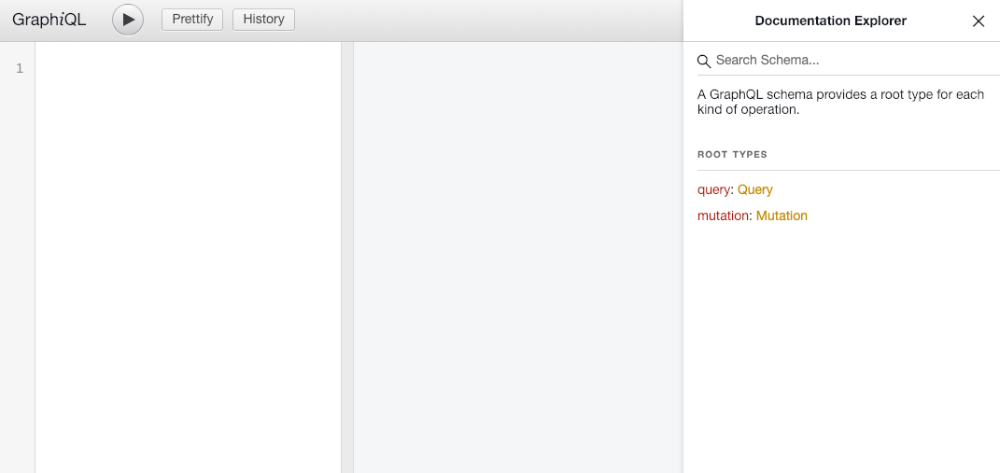

# 👨🏻‍💻 Rami's Online Marketplace 👨🏻‍💻

Below you can documentation on how to get the project up and running as well as how to use the API. Documentation for specific queries can be found on GraphQL IDE. I wrote comments as well throughout the code (mainly in the model and query/mutation/resolver files) to help explain parts of the code better and the decisions I made.

## Table of Contents

* [Tech Used](https://github.com/ramitaleb/Online-Marketplace#tech-used)

* [Getting Started](https://github.com/ramitaleb/Online-Marketplace#getting-started)

* [The API](https://github.com/ramitaleb/Online-Marketplace#the-api)
  
  * [The Models](https://github.com/ramitaleb/Online-Marketplace#the-models)
  
    * [Product](https://github.com/ramitaleb/Online-Marketplace#product)
    
    * [Item](https://github.com/ramitaleb/Online-Marketplace#item)
    
    * [Cart](https://github.com/ramitaleb/Online-Marketplace#cart)
    
    * [Class Diagram](https://github.com/ramitaleb/Online-Marketplace#class-diagram)
  
  * [Creating a Product](https://github.com/ramitaleb/Online-Marketplace#creating-a-product)
  
  * [Restocking a Product](https://github.com/ramitaleb/Online-Marketplace#restocking-a-product)
  
  * [Querying for Products](https://github.com/ramitaleb/Online-Marketplace#querying-for-products)
  
    * [Querying for a Single Product](https://github.com/ramitaleb/Online-Marketplace#querying-for-a-single-product)
    
      * [Querying by ID](https://github.com/ramitaleb/Online-Marketplace#querying-by-id)
      
      * [Querying by Title](https://github.com/ramitaleb/Online-Marketplace#querying-by-title)
      
    * [Querying for Multiple Products](https://github.com/ramitaleb/Online-Marketplace#querying-for-multiple-products)
    
      * [Querying for all Products](https://github.com/ramitaleb/Online-Marketplace#querying-for-all-products)
      
      * [Querying for all Available Products](https://github.com/ramitaleb/Online-Marketplace#querying-for-all-available-products)
      
  * [Creating a Cart](https://github.com/ramitaleb/Online-Marketplace#creating-a-cart)
  
  * [Adding a Product to Cart](https://github.com/ramitaleb/Online-Marketplace#adding-a-product-to-cart)
  
  * [Querying for a Cart](https://github.com/ramitaleb/Online-Marketplace#querying-for-a-cart)
  
  * [Remove a Product from Cart](https://github.com/ramitaleb/Online-Marketplace#remove-a-product-from-cart)
  
  * [Checkout a Cart](https://github.com/ramitaleb/Online-Marketplace#checkout-a-cart)
  
  
## Tech Used
I've recently picked up a keen interest in using Ruby on Rails for building web application so for that reason I chose to use Ruby on Rails to create this API. 

I decided to use GraphQL because honestly because I've been hearing about it a lot recently but never had the chance to use it so I decided I would use this opportunity to learn it and showcase my quick learning skills. I found it very easy to get used to and extremely efficient as I was no longer over/under querying and having to parse data afterwards.
  
## Getting Started
Before you go ahead and clone this repo, make sure you have **Ruby**, **Rails** and **SQLite** already installed on your machine or else nothing is going to work 😭.

Once thats all taken care of, navigate to a clean directory and clone the repo!

Now that's taken care of we can start getting this project running. Go ahead and navigate into the repo and run:

`bundle`

This will make sure all gem dependencies are installed.

When thats done you're going to need to run these two commands to migrate and seed the database:

```
rake db:migrate
rake db:seed
```

Now that everything is set, its time to pull the level and start the server:

`rails server`

If everything went as expected then you should be able to fire up a web browser and navigate to ➡️ `http://localhost:3000/`

If you see the following screen that means the everything is going well ad the server is running! ✅


At this point you should be able to access `http://localhost:3000/graphiql` to access the GraphiQL IDE. This IDE allows you not only allows you to run different queries on the database from the browser and see the results but also access documentation to do with the different queries and mutations you can perform on the database. More documentation on how to execute these queries and mutations can be found below in the API section of this doc.

This is how GraphiQL should look like:


## The API
I decided to use [GraphQL](https://graphql.org/) as I've never used it before and I thought it would be a great opportunity to get my feet wet with it. *The bonus points also don't hurt* 🤪

Code for the API and the queries/mutations can be found if you navigate to `app/graphql`.

### The Models
Before we get into using the API we should familiarize ourselves with the models that we'll be working with.

Code for the models can be found if you navigate to `app/models`.

#### Product
The **Product** model is what we're going to be using to model our Products and it has the following attributes:

`title`: String

`price`: Float

`inventory_count`: Integer

#### Item
The **Item** model is what we are using to represent every physical entity of a Product (making use of Software Design Patterns here 😋). It has the following attributes:

`title`: String

`price`: Float

`product`: Foreign key

`cart`: Foreign key

#### Cart
The **Cart** model 🛒 is what we are using to store multiple products that are ready to be purchased together. It has the following attributes:

`order_total`: Float

`order_status`: String

`items`: [Foreign key]

#### Class Diagram
Hopefully this class diagram gives you a better visual understanding of our models.


### Creating a Product
To be able to query for products, we must first have products to query. This is how we're going to do that.
You're going to want to write a mutation that will be able to create whatever you specify to the database.

```
Example:
mutation {
  create_product (
    title: "sandwich"
    price: 5.00
    inventory_count: 80
  ) {
    id
    title
    price
    inventory_count
  }
}
```
```
Output:
{
  "data": {
    "create_product": {
      "id": "1",
      "title": "sandwich",
      "price": 5,
      "inventory_count": 80
    }
  }
}
```
What this will do is it will create a sandwich 🥪, with the price of 5.00 and an inventory count of 80 then return to you the object its created. You can change these values to whatever you'd like as long as they respect the type of the given attribute.

### Restocking a Product
Eventually you may run out of inventory for a certain product and you'd like to restock it. Well, you're in luck 🍀 because I have just the mutation for you. Check this out:

```
Example:
mutation {
  restock_product(
    id: 1
    quantity: 5
  ) {
    id
    title
    price
    inventory_count
  }
}
```
```
Output:
{
  "data": {
    "restock_product": {
      "id": "1",
      "title": "sandwich",
      "price": 5.00,
      "inventory_count": 85
    }
  }
}
```

### Querying for Products
Now that we have a product or multiple products in our database, we can start querying for them.

#### Querying for a Single Product
##### Querying by ID
Here we are querying for a product by its unique ID. We are asking for it to return to us the `id`, `title`, `price` and `inventory_count`. 

```
Example:
{
  products(id: 1) {
    id
    title
    price
    inventory_count
  }
}
```
```
Output:
{
  "data": {
    "products": {
      "id": "1",
      "title": "sandwich",
      "price": 5.00,
      "inventory_count": 80
    }
  }
}
```
As you can see it returns for us just the one product that we specified we wanted using the ID.

##### Querying by Title
Here we are querying for a product by its title.

```
Example:
{
  products(title: "sandwich") {
		id
    title
    price
    inventory_count
  }
}
``` 
```
Output:
{
  "data": {
    "products": {
      "id": "1",
      "title": "sandwich",
      "price": 5.00,
      "inventory_count": 80
    }
  }
}
```
As you can see it returns for us just the one product that we specified we wanted using the title.

#### Querying for Multiple Products
##### Querying for all Products
Here we are querying for all products.

```
Example:
{
  products() {
    id
    title
    price
    inventory_count
  }
}
```
OR
```
{
  products(only_available: false){
    id
    title
    price
    inventory_count
  }
}
```
```
Output: 
{
  "data": {
    "products": [
      {
        "id": "1",
        "title": "sandwich",
        "price": 5.00,
        "inventory_count": 80
      },
      {
        "id": "2",
        "title": "headphones",
        "price": 55.00,
        "inventory_count": 800
      },
      {
        "id": "3",
        "title": "love",
        "price": 1.00,
        "inventory_count": 0
      }
    ]
  }
}
```
In both cases you can see it returns for us all products currently in our marketplace.

##### Querying for all Available Products
Available products are products with an `inventory_count > 0`. We must pass an argument `only_available: true` to be able to only see the products that are available. 

```
Example:
{
  products(only_available: true){
    id
    title
    price
    inventory_count
  }
}
```
```
Output:
{
  "data": {
    "products": [
      {
        "id": "1",
        "title": "sandwich",
        "price": 5.00,
        "inventory_count": 80
      },
      {
        "id": "2",
        "title": "headphones",
        "price": 55.00,
        "inventory_count": 800
      }
    ]
  }
}
```
As you can see here, we only were returned the products `sandwich` and `headphones`. Since the product `love` has an `inventory_count` of 0 it is not shown in this output. 💔

### Creating a Cart
So, you've had time to browse the marketplace and its time to make some purchases. We're firstly going to need to create a cart 🛒. Here's how to do that:

```
Example:
mutation {
  create_cart () {
    id
    order_total
    order_status
    items{
      id
      title
      price
    }
  }
} 
```
```
Output:
{
  "data": {
    "create_cart": {
      "id": "1",
      "order_total": 0,
      "order_status": "In Progress",
      "items": []
    }
  }
}
```
So you can see we successfully were able to create a cart and it says that it is currently in progress, meaning it hasn't been checked out yet.

### Adding a Product to Cart
You found a sandwich 🥪 you think would taste amazing and would like to buy it. Let's add it to our cart! Make sure you specify the product ID of the product you want and the cart ID of the cart you'd like to add that product to. Just execute this mutation (or twice if you're really hungry 😆):

```
Example:
mutation {
  add_to_cart (
    product_id: 1
    cart_id: 1
  ) {
    id
    order_total
    order_status
    items{
      id
      title
      price
    }
  }
}
```
```
Output:
{
  "data": {
    "add_to_cart": {
      "id": "1",
      "order_total": 5,
      "order_status": "In Progress",
      "items": [
        {
          "id": "1",
          "title": "sandwich",
          "price": 5
        }
      ]
    }
  }
}
```

As you add more products to your cart you'll notice your items list to expand as well as your order_total to increase.

### Querying for a Cart
After adding a product or two to your cart 🛒 you may want to check on it to make sure you're not spending too much money. Well all you need to do that is to specify the cart ID in the following mutation:

```
Example:
{
  cart_by_id (id:1) {
    id
    order_total
    order_status
    items {
      id
      title
      price
    }
  }
}
```
```
Output:
{
  "data": {
    "cart_by_id": {
      "id": "1",
      "order_total": 5,
      "order_status": "In Progress",
      "items": [
        {
          "id": "1",
          "title": "sandwich",
          "price": 5
        }
      ]
    }
  }
}
```


### Remove a Product from Cart
You realized you had leftover shawarma from last night so you want to remove the sandwich from your cart. What you'll need to do is to specify the cart ID and the item ID like this:

```
Example:
mutation{
  remove_item_from_cart(
    cart_id:1,
    item_id:1
  ) {
    id
    order_total
    order_status
    items{
      id
      title
      price
    }
  }
}
```
```
Output:
{
  "data": {
    "remove_item_from_cart": {
      "id": "1",
      "order_total": 0,
      "order_status": "In Progress",
      "items": []
    }
  }
}
```

**IMPORTANT**: The item ID is different from the product ID! Check your cart to ensure you have the right item ID before executing this mutation.

**NOTE**: When you have multiple items in a cart and one is removed, the `order_total` of the cart will update to reflect the items remaining in the cart.

### Checkout a Cart
Last but certainly not least, we have the checking out of a cart. After lots of back and forth you finally decided you would go ahead and purchase a sandwich! Can't wait any longer? Here's the mutation:

```
Example:
mutation {
  checkout_cart (
    cart_id: 1
  ) {
    id
    order_total
    order_status
    items{
      id
      title
      price
    }
  }
}
```
```
Output:
{
  "data": {
    "checkout_cart": {
      "id": "1",
      "order_total": 5,
      "order_status": "Completed",
      "items": [
        {
          "id": "1",
          "title": "sandwich",
          "price": 5
        }
      ]
    }
  }
}
```

**NOTE**: After checking out a cart, the `inventory_count` of the products within the cart will be decremented by the number of times an item of that product was in the cart. If a product has an `inventory_count` of 0 or is in other words out of stock it will not decrement the `inventory_count`. You can check the inventory count of the products by [Querying for Products](https://github.com/ramitaleb/Online-Marketplace#querying-for-products).

**NOTE 2**: If a cart can be completely purchased successfully with no products that are out of stock you will see the `order_status` change to "Completed". If it can not be purchased successfully due to a product being out of stock then you will see the `order_status` change to "Partially Completed".
